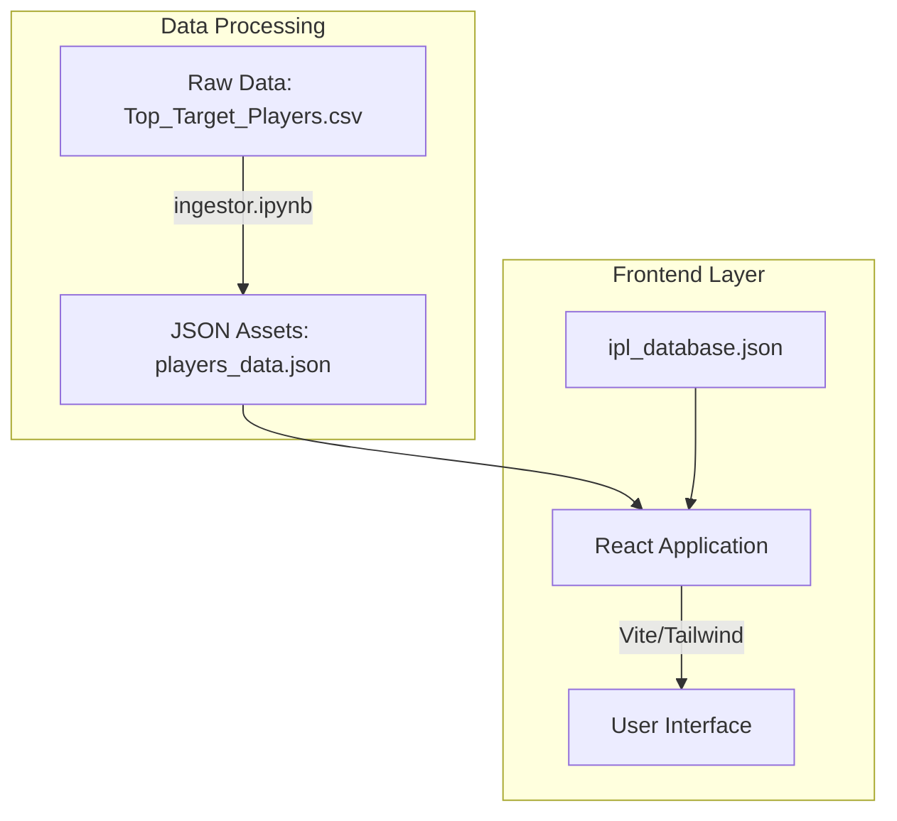

## Architecture Diagram



# IPL Capex Optimizer

    

> A high-performance data visualization dashboard for IPL player auction strategy and capital expenditure analysis.

## 📖 Table of Contents
- [🚀 Overview](#-overview)
- [✨ Key Features](#-key-features)
- [🏗️ Architecture & Tech Stack](#-architecture--tech-stack)
- [📁 Directory Structure](#-directory-structure)
- [🛠️ Getting Started](#-getting-started)
- [🔌 API Reference / Usage](#-api-reference--usage)
- [🤝 Contributing](#-contributing)
- [📜 License](#-license)

## 🚀 Overview
IPL Capex Optimizer is a specialized analytical tool designed for Indian Premier League (IPL) franchises to evaluate player performance against auction costs. It bridges the gap between raw statistical data and actionable financial insights. The project processes complex cricket datasets using a Python-based ingestion pipeline and presents a streamlined, interactive dashboard for team management to make data-driven decisions during the high-stakes auction environment.

## ✨ Key Features
- **Automated Data Ingestion**: Uses a dedicated Jupyter Notebook (`ingestor.ipynb`) to clean, transform, and normalize raw player CSV data into optimized JSON formats for the frontend.
- **Real-time Filtering**: Leverages React's state management to allow users to filter target players based on specific metrics.
- **Visual Analytics**: Built with Tailwind CSS for a responsive, high-fidelity UI that presents player stats and budget impact clearly.
- **Local Data Caching**: Utilizes static JSON assets to ensure the dashboard remains fast and accessible without requiring a heavy backend server.
- **Strict Linting**: Implements an ESLint flat-config system to maintain code quality and prevent runtime errors in the frontend.

## 🏗️ Architecture & Tech Stack
The system follows a decoupled architecture separating data processing from the presentation layer:

- **Data Processing (Python/Pandas)**: The `ingestor.ipynb` notebook acts as the ETL (Extract, Transform, Load) engine. It processes `Top_Target_Players.csv` and outputs structured JSON assets.
- **Frontend (React/Vite)**: A modern Single Page Application (SPA) built with Vite for lightning-fast HMR (Hot Module Replacement). React components consume the processed JSON data to build interactive views.
- **Styling (Tailwind CSS)**: Utilizes utility-first CSS for rapid UI development and consistent design language.
- **Data Storage**: Uses flat-file storage (JSON) located in `frontend/src/assets` to serve as a high-speed, read-only database.

## 📁 Directory Structure
```text
.
├── ingestor.ipynb           # Python ETL pipeline for processing CSV data
├── requirements.txt         # Python dependencies (Pandas, NumPy, etc.)
├── Top_Target_Players.csv   # Raw source data for player metrics
└── frontend/
    ├── src/
    │   ├── assets/          # Processed JSON data and images
    │   │   ├── ipl_database.json
    │   │   └── players_data.json
    │   ├── App.jsx          # Core dashboard logic
    │   └── main.jsx         # React entry point
    ├── vite.config.js       # Build and plugin configuration
    └── tailwind.config.js   # UI theme and styling rules
```

## 🛠️ Getting Started

### Prerequisites
- **Node.js**: v18.x or higher
- **Python**: v3.9 or higher
- **npm** or **yarn**

### Environment Variables
No external environment variables are required for the base installation, as the project relies on local JSON assets. [Check Code] if integrating with an external API in the future.

### Installation & Running Locally
1. **Prepare the Data Pipeline**:
   ```bash
   # Create virtual environment
   python -m venv venv
   source venv/bin/activate
   # Install dependencies
   pip install -r requirements.txt
   # Run the notebook (optional: if you need to update data)
   jupyter notebook ingestor.ipynb
   ```

2. **Start the Dashboard**:
   ```bash
   cd frontend
   npm install
   npm run dev
   ```

## 🔌 API Reference / Usage
Since this is a client-side driven application, there is no REST API. The application consumes internal data structures:

**Data Schema (`players_data.json`):**
| Field | Type | Description |
| :--- | :--- | :--- |
| `player_name` | String | Full name of the player |
| `target_price` | Number | Expected auction price |
| `role` | String | Player specialization (Batsman/Bowler/All-rounder) |
| `performance_score` | Float | Normalized metric from 0-10 |

**Example Component Usage:**
```jsx
import playersData from './assets/players_data.json';

function Dashboard() {
  return (
    <div className="grid grid-cols-1 md:grid-cols-3">
      {playersData.map(player => (
        <PlayerCard key={player.id} data={player} />
      ))}
    </div>
  );
}
```

## 🤝 Contributing
1. Fork the Project
2. Create your Feature Branch (`git checkout -b feature/AmazingFeature`)
3. Commit your Changes (`git commit -m 'Add some AmazingFeature'`)
4. Push to the Branch (`git push origin feature/AmazingFeature`)
5. Open a Pull Request

## 📜 License
Distributed under the MIT License. See `LICENSE` for more information.
